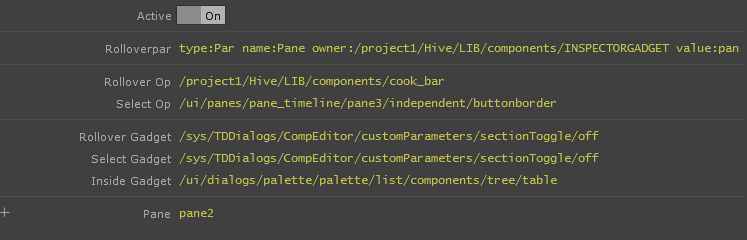

#INSPECTOR GADGET

InspectorGadget is a part of the HIVE family ofTouchDesigner components and scripts 
by [Vincent Naples](maiilto:Vincent@drmbt.com) [@drmbt](instagram.com/drmbt)

Inspector Gadget is a global component referenced as op.INSPECTORGADGET
that stores persistent, reliable and dependable values for ui elements
interacted with in your TD session.

While active, it evaluates a host of Tscript expressions and stores them
as customPar values that can be referenced anywhere in your project. These are 
dependable, and faster then constantly evaluating the python alternatives
such as ui.rolloverPar and ui.rolloverOp, and has methods that haven't been
ported from Tscript to Python yet

##Parameters

Rolloverpar:  
    returns the last rolled over parameter in a network or parameterCOMP ui element

Rolloverop:  
    return the last rolled over operator in a network

Selectop:  
	return the currently selected op path in a network

Rollovergadget:  
    return the currently rolled over ui element (gadget is Tscript talk for active panels)

Selectgadget:  
    return the last clicked on panel

Insidegadget:  
    return a gedget the mouse is currently hovering over